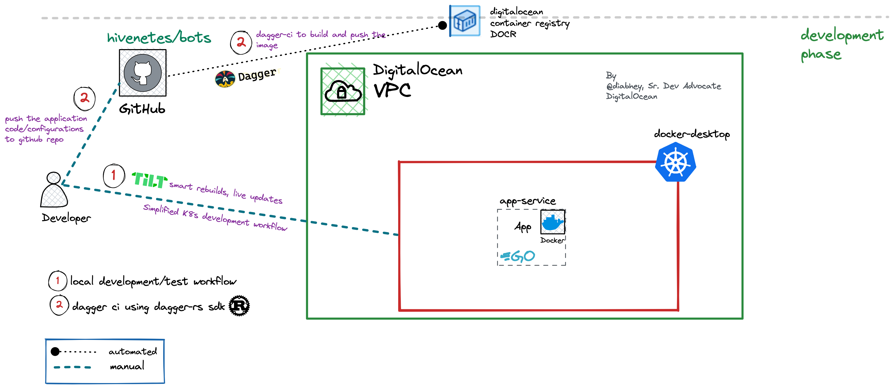

# Bots: more than an App

This project will help you create a streamlined microservices development workflow for Kubernetes.

We have leveraged popular tools such as [Tilt](https://tilt.dev/), [Docker Desktop](https://www.docker.com/products/docker-desktop/), and [dagger-rs](https://github.com/kjuulh/dagger-rs) to achieve this.

> [Before you begin >>](./docs/blog.md)


## Prerequisites

* [Docker Desktop](https://www.docker.com/products/docker-desktop/)
* [Tilt](https://docs.tilt.dev/install.html)
* [Cargo](https://doc.rust-lang.org/cargo/getting-started/installation.html)

## Local Development using Tilt

* Copy the `tilt_config.json` from `tilt-resources/` to root dir

    ```bash
    cp tilt-resources/local/tilt_config_local.json tilt_config.json
    ```

* Start Tilt:

    ```bash
     tilt up
     # Open the UI on a browser at http://localhost:10350/
     ```

* Once the development is done, stop Tilt

    ```bash
    # Cleans up all the resources specified in the Tiltfile
    tilt down
    ```

## Overview of the Development workflow


